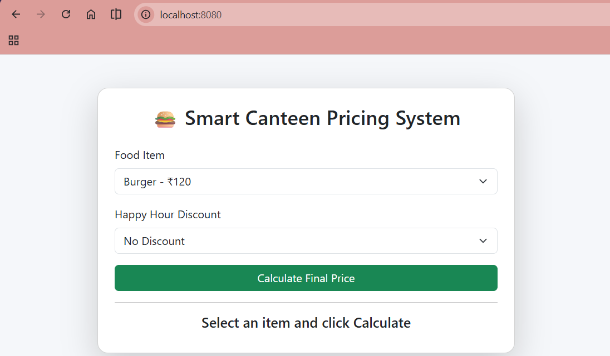
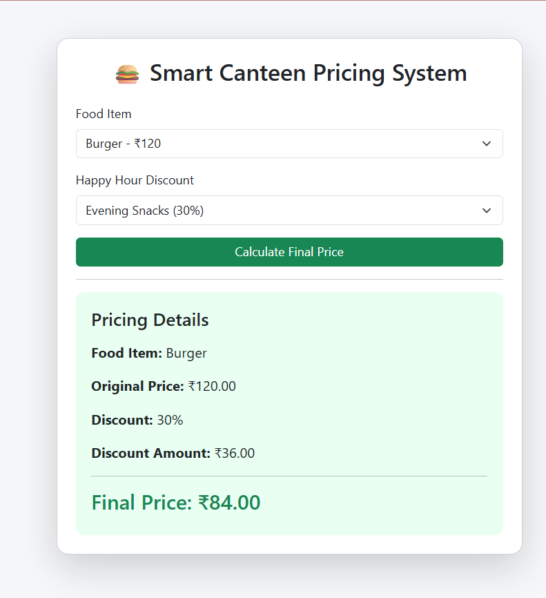

# 🍔 Smart Canteen Pricing System


A web-based **Smart Canteen Pricing System** developed using **Go (Golang)** that demonstrates the practical implementation of **Closures (Anonymous Functions)** through a real-world pricing application.

The application allows users to select a food item, choose a Happy Hour discount, and calculate the final payable amount. The backend uses **Go Closures** to dynamically generate independent discount functions, making the pricing system reusable, modular, and maintainable.

---

# 📖 Case Study

**Case Study 6 – Smart Canteen Pricing System using Closures in Go**

This project demonstrates how **Closures** can be applied in a practical business scenario where multiple discount strategies are generated dynamically using a **Factory Function**.

Each generated discount function maintains its own internal state by remembering its assigned discount percentage independently.

---

# ✨ Features

- 🍔 Smart Canteen Pricing System
- ⚡ Built using Go (Golang)
- 🌐 REST API Implementation
- 📦 JSON Request & Response
- 🧠 Closure (Anonymous Function) Implementation
- 🏭 Factory Function Pattern
- 💰 Dynamic Price Calculation
- 🎉 Happy Hour Discount System
- 📱 Responsive User Interface
- 📂 Modular Project Structure
- 🎨 Bootstrap 5 UI

---

# 🛠 Technologies Used

## Backend

- Go (Golang)
- net/http
- encoding/json

## Frontend

- HTML5
- CSS3
- JavaScript (ES6)
- Bootstrap 5

---

# 📷 Screenshots

Create a folder named **screenshots** in your project.

```
canteen-pricing/
│
├── screenshots/
│      ├── home-page.png
│      ├── pricing-result.png
│      └── api-response.png
```

### 🏠 Home Page



---

### 💰 Price Calculation



---

### 📦 API Response


---

# 📁 Project Structure

```
canteen-pricing/
│
├── go.mod
├── .gitignore
├── README.md
├── main.go
│
├── handlers/
│     └── pricing.go
│
├── models/
│     └── item.go
│
├── pricing/
│     └── discount.go
│
├── routes/
│     └── routes.go
│
├── static/
│     ├── index.html
│     ├── style.css
│     └── app.js
│
└── screenshots/
      ├── home-page.png
      ├── pricing-result.png
      └── api-response.png
```

---

# ⚙ Requirements

- Go 1.25 or later
- Modern Web Browser
- VS Code (Recommended)

---

# 🚀 Installation

## 1. Clone Repository

```bash
git clone https://github.com/<your-username>/canteen-pricing.git
```

or download the ZIP file.

---

## 2. Navigate to the Project

```bash
cd canteen-pricing
```

---

## 3. Initialize Go Module (Skip if already initialized)

```bash
go mod init canteen-pricing
```

---

## 4. Run the Application

```bash
go run .
```

---

## 5. Open in Browser

```
http://localhost:8080
```

---

# 🖥 Application Workflow

```
User

↓

Select Food Item

↓

Select Discount Offer

↓

Click Calculate

↓

JavaScript

↓

REST API

↓

Go HTTP Server

↓

Pricing Handler

↓

Closure Created

↓

Price Calculated

↓

JSON Response

↓

Browser Updates UI
```

---

# 🧠 Closure Implementation

The most important part of this project is the use of **Closures**.

## Factory Function

```go
func CreateDiscounter(percent float64) func(float64) float64 {

	return func(price float64) float64 {

		discount := price * percent / 100

		return price - discount

	}

}
```

---

## Example

```go
breakfast := CreateDiscounter(10)

lunch := CreateDiscounter(20)

fmt.Println(breakfast(100))

fmt.Println(lunch(100))
```

Output

```
90

80
```

Each generated function remembers its own discount percentage independently.

---

# 🔍 How Closures Work

```
CreateDiscounter(10)

↓

Creates Anonymous Function

↓

Stores

↓

percent = 10

↓

Returns Function
```

Later

```
breakfast(120)
```

still remembers

```
10%
```

Another call

```
CreateDiscounter(20)
```

creates another independent function.

```
Breakfast

↓

10%

Lunch

↓

20%
```

Both closures maintain completely separate states.

---

# 📦 REST API

## Endpoint

| Method | Endpoint | Description |
|---------|----------|-------------|
| POST | `/calculate` | Calculates discounted price |

---

## Request

```json
{
    "itemName":"Burger",
    "price":120,
    "discount":20
}
```

---

## Response

```json
{
    "itemName":"Burger",
    "originalPrice":120,
    "discountPercent":20,
    "discountAmount":24,
    "finalPrice":96
}
```

---

# 📂 Module Overview

## main.go

- Starts HTTP Server
- Registers Routes
- Serves Static Files

---

## handlers

- Receives HTTP Requests
- Validates JSON
- Calls Closure Logic
- Sends JSON Response

---

## pricing

Contains the business logic.

Implements

- Factory Function
- Anonymous Function
- Closure

---

## models

Contains

- PricingRequest
- PricingResponse

---

## routes

Registers

```
POST /calculate
```

---

## static

Contains

- HTML
- CSS
- JavaScript

---

# 💡 Go Concepts Demonstrated

- Functions
- Anonymous Functions
- Closures
- Factory Pattern
- Structs
- Packages
- HTTP Server
- REST APIs
- JSON Encoding
- JSON Decoding
- Modular Programming

---

# 🎯 Learning Outcomes

This project demonstrates:

- Understanding Closures in Go
- Anonymous Functions
- Returning Functions
- State Isolation
- Factory Functions
- REST API Development
- JSON Handling
- HTTP Server Development
- Frontend & Backend Integration

---

# 🧪 Sample Test

| Item | Original Price | Discount | Final Price |
|------|---------------:|---------:|------------:|
| Burger | ₹120 | 20% | ₹96 |
| Pizza | ₹250 | 40% | ₹150 |
| Coffee | ₹80 | 10% | ₹72 |

---

# 📚 Why Closures?

Closures allow a function to **capture and remember variables from its surrounding scope**, even after the outer function has completed execution.

Advantages in this project:

- Independent discount functions
- No global variables
- Better encapsulation
- Cleaner business logic
- Reusable pricing strategies
- Easy to extend with new offers

---

# 🔮 Future Enhancements

- 👤 User Authentication
- 🛒 Order Management
- 📊 Admin Dashboard
- 🗄 Database Integration (MySQL/MongoDB)
- 🍽 Dynamic Menu Management
- 🧾 Bill Generation
- 💳 Payment Gateway
- 📦 Order History
- 🎁 Coupon System
- ⭐ Loyalty Reward Points
- 📈 Sales Analytics
- 📱 Progressive Web App (PWA)

---

# 👨‍💻 Author

**Siddhesh Mayekar**

Bachelor of Science in Information Technology (B.Sc. IT)

Kirti M. Doongursee College

GitHub: https://github.com/SiddheshMayekar-lab

---

# 📄 License

This project is developed for **educational purposes** as part of the **Go Programming Case Study (Closures)**.

---

## ⭐ Support

If you found this project helpful, consider giving it a ⭐ on GitHub.